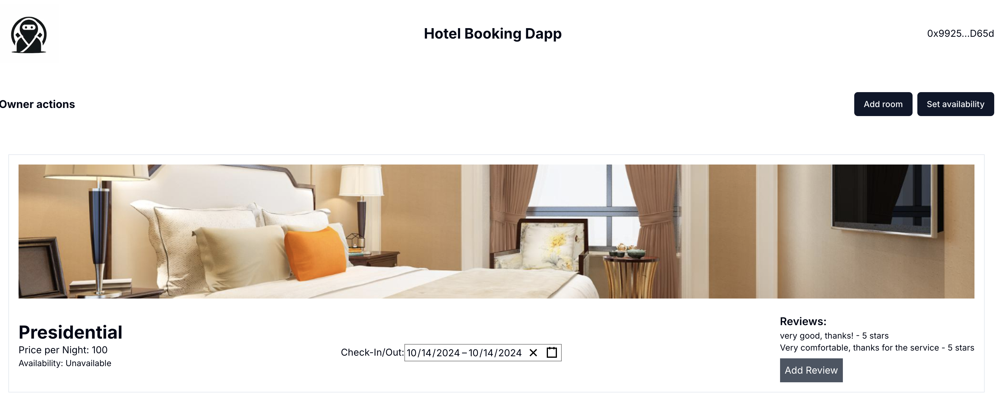

# A Decentralized Hotel Booking System on Morph

This project aims to build a decentralized hotel booking system on the MorphL2 blockchain using Solidity smart contracts and a React & Wagmi front-end, which allows hotel owners to add rooms, manage room availability, accept bookings, and receive reviews from guests.

